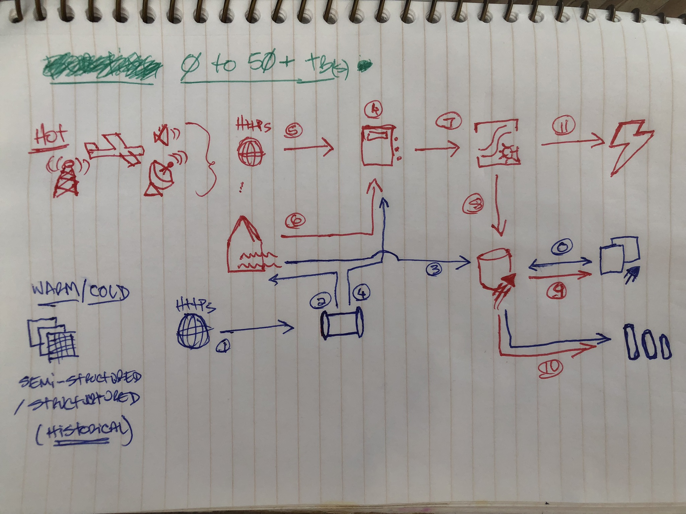

# Microsoft Fabric Real-Time Analytics 

## Flight Stream Demo ✈️

### Description
Encompasses a use-case using airline flight data for the following Microsoft Fabric features: 
1. Eventstream 
2. Notebook
3. KQL Database
4. Power BI Report

### Scenario 

#### 1. Stream
An aircraft is continuously sending data points in a real-time stream using Microsoft Fabric Eventstream. In Power BI, we see data points indicating a flight has departed Newark international.

James works for the port authority of a large city. His organization manages one of the local international airports. Part of his job is to mitigate noise pollution cause by civil aviation traffic in the area surrounding the airport.

James has access to a real-time feed of aircraft departing from the airport in the last hour stored in Microsoft Fabric KQL Database. Some residents have complained about louder than usual noises in their neighborhood. Part of the port authority’s legal duties is to report any violation of operation procedures to the federal aviation administrations.

#### 2. Analytics

In a Power BI Report, James zooms in on a few datapoints where the plane has executed a right turn north.

Today James is looking if Flight number 753 has climbed to or above the required 2,500 feet altitude over residential area which is a recommended minimum flight altitude for commercial jet airliners.

#### 3. Insights

James hovers over a few points in sequence to show the latitude, longitude and altitude of the aircraft. In Power BI, we see the number is compliant with the regulations.

Upon closer inspection, the plane reached 2,500 feet above an industrial sector and therefore is compliant with the federal recommendations.

This is but a small sample of the air traffic in the area. What if we could automate this? With Fabric real-time analytics, the port authority has defined restricted geographical zones where planes must be compliant with minimal altitude requirements.

With the power of the KQL language and its native geospatial functions, we can now detect in real time the aircrafts that are non-compliant.

#### 4. Actions

Additionally, we can display geojson shapes around areas; for example, Newark international. Then we can switch to a Microsoft Fabric KQL Queryset that detects violations to raise alerts using Microsoft Fabric Data Activator Reflex.

Now that we have an easy way to detect these situations, James can focus his effort on proactive noise mitigations by working with air traffic control to avoid these situations in the future.

Lastly, we have a KQL Queryset that forecasts the plane’s altitude and uses that to predict if the next data point(s) will be in violation of the noise regulations.

#### Welcome to Real-time Analytics with Microsoft Fabric! 💚

### Architecture (Draft)

## Contributing

This project welcomes contributions and suggestions.  Most contributions require you to agree to a
Contributor License Agreement (CLA) declaring that you have the right to, and actually do, grant us
the rights to use your contribution. For details, visit https://cla.opensource.microsoft.com.

When you submit a pull request, a CLA bot will automatically determine whether you need to provide
a CLA and decorate the PR appropriately (e.g., status check, comment). Simply follow the instructions
provided by the bot. You will only need to do this once across all repos using our CLA.

This project has adopted the [Microsoft Open Source Code of Conduct](https://opensource.microsoft.com/codeofconduct/).
For more information see the [Code of Conduct FAQ](https://opensource.microsoft.com/codeofconduct/faq/) or
contact [opencode@microsoft.com](mailto:opencode@microsoft.com) with any additional questions or comments.

## Trademarks

This project may contain trademarks or logos for projects, products, or services. Authorized use of Microsoft 
trademarks or logos is subject to and must follow 
[Microsoft's Trademark & Brand Guidelines](https://www.microsoft.com/en-us/legal/intellectualproperty/trademarks/usage/general).
Use of Microsoft trademarks or logos in modified versions of this project must not cause confusion or imply Microsoft sponsorship.
Any use of third-party trademarks or logos are subject to those third-party's policies.

## Privacy and Telemetry Notice 

This project does not have source code that enables Microsoft to collect telemetry. This project has only artifact scripts and guidance that can be used to reproduce samples in Microsoft Fabric workspaces, and/or other Azure Analytics services. Microsoft services may collect telemetry for metrics, which are not in scope for this project.

